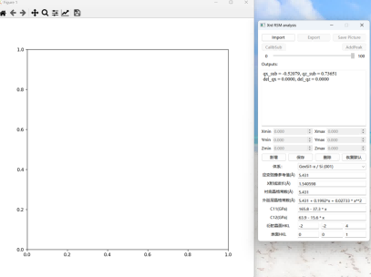
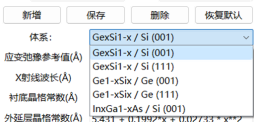
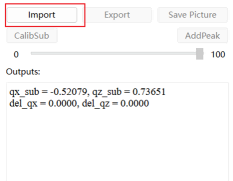
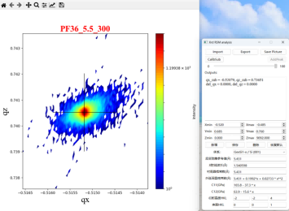
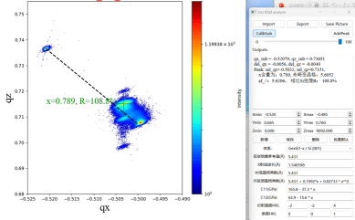

# XrdRSM
一个用于计算XRS-RSM的小程序；

也可以打开omge-2theta / 2theta / omega线扫描的数据，plot log图，将.xrdml数据转换成txt，等无拟合功能，

新增2Θ-ω复选，可选择plot qx/qx或ω/2Θ

code部分基于 numpy 1.xx 和matplotlib 3.6.3版本，用较新版本的可能会报错。

# 使用说明
下载 dist/XRD_RSM.zip， 解压之后，运行XRD_RSM.exe文件，初次打开界面如下：

## 1.选择要分析的材料结构
**（只能分析二元薄膜）**

如果下拉列表中没有需要的材料结构，请自行添加，操作如下：
*    点新增，在弹窗中输入名称；
*    修改新增条件的对应参数；
*    点保存。
如果要删除某些条目，或者恢复默认，点对应按钮即可。

## 2.导入数据：点Import
**支持格式为： Xpert源文件（.xrdml格式）**

## 3.校准衬底

手动选择衬底峰位，然后点CalibSub

其中，在坐标区 鼠标左键点击可以低部率放大，中键单击可较高倍放大。右键恢复恢复大小。

## 4.峰位分析

手动选择需要分析的峰位，点AddPeak，可计算该峰位的含量。可计算多个峰。

Export ：导出原始数据为txt格式

SavePicutre：保存图片

